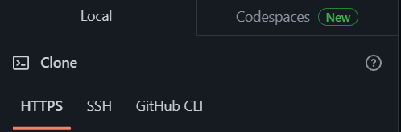

# SSH_Keys

An introduction to SSH Keys and how to use them to interact eith GitHub.

---

**SSH keys** are an *access credential used in SSH protocol (Secure Shell)*. 
- A **secure shell** is a *network protocol, which helps to login from one computer to another securely, as well as to manage networks, operating systems, and configurations*.
- Functionally, **SSH keys** are *nearly the same as passwords*, but it’s **more secure to log into a server with SSH keys than use only passwords because to decrypt SSH is very difficult, almost impossible**.

---

## Using SSH keys

### Showcasing the use of SSH keys to push changes to GitHub


--- 

### **Step 1** - *Create an SSH RSA key*

- Open a `Git bash` terminal.
```
cd .ssh # folder in local machine where we store our ssh keys

ssh-keygen -t rsa -b 4096  -C "your_email_address" 

# `-keygen` = key generate
# `-t` = type of key
# `rsa` = type of ssh key we use
# `-b` = bit size of the key
# `4096` = size we give to the key
```
- Name they key specifying usually the purpose of the key, e.g. `github-key`.
- When prompted to introduce a passphrase, leave it empty and simply press `Enter` and `Enter` again when asked to confirm the passphrase.
- The process will generate a random art image for the key.

--- 
- We should now have 2 files generated in our .ssh folder:
1. `github-key`
2. `github-key.pub`

This refers to the fact that there are 2 parts of the key: a **public** part (padlock = public key), and a **private** part (key = private key).
- *The padlock* is the **public file**, due to being accessible to anyone, but if you don t have the right key, it won`t work.

 `github-key.pub = public key`


- *The key* is the **private file** due to the key being unique and not accessible to anyone else but us. 

`github-key = private key`

---

**RSA keys** = Assimetric encryption system 
- RSA Keys use 2 keys:

a.  **public key** (which can be generated from private ket).

b.  **private key** (can`t be generated from public key; cannot be lost and must be kept safe at all times).

- RSA keys = mathematically generated. Complex mathematical algorithm. If you don`t have the padlock, you can still generate it if you have only the key. 
- RSA keys = authentication keys, not encryption keys (because the encryption of data is established through SSH anyways).

---

### **Step 2** - *Add our key to github account*

This step means attaching the public key to GitHub.
- Go to `Settings` on GitHub.
- Go to `SSH and GPG Keys`- `New SSH Key`.
- Name it similarly to your file and mention its purpose e.g. `github-key`.
- Go to your `Git bash`.
```
cat github-key.pub
```
- Copy exactly the whole content of the public key, **without any spaces**.
- Paste the content of the key in GitHub (you will know you copied the content of the `github-key.pub` file properly when you have `ssh-rsa` at the top and your **full email address** at the end. 
- Select `Create SSH key`.
- You should now see your new SSH key being created in GitHub.
---

### **Step 3*** - *Add your private key to your local host`s list of keys used by SSH*

- Commands used to register keys to the list of keys used by ssh:
```
eval `ssh-agent -s` 
ssh-add github-key
```
- Command to check that the private key has actually connected us to GitHub:
```
ssh -T git@github.com 
```
- You may be now prompted to allow the key to be used, in which case, please type `yes`.
- You should receive an output looking similar to this: 
```
Hi FlrMh! You've successfully authenticated, but GitHub does not provide shell access.
```

---


### **Step 4** - *Create a new repo on GitHub to test the SSH authentication*

- On GitHub, create a public repo named `test-ssh`.
- No need for README.md file or any gitignore files either.
- At the top, we can see the ways of accessing our GitHub repo.



- Select `SSH` and copy the path prompted.
- Return to your `Git Bash` terminal.
- `cd` into the folder where you normally create your GitHub local repos.
- Create a local repo `test-ssh`:
```
mkdir test-ssh
```
- Create a `readme.md` file within the new local repo:
```
touch readme.md
```
- Add some ccontent to the file:
```
nano readme.md
```
- Save the changes and exit:
```
Ctrl+X
Y
Enter
```
- Print the content of the file to make sure the changes were saved:
```
cat readme.md
# should outputs the content you just added in the file.
```

---


### **Step 5** - *Push your changes to GitHub using SSH*

```
git init
# creates the hidden folder `.git` and certain files that store the changes, commits, and changes in the staged area

git add .
# adds all the changes made to the staging area

git status
# checking the status of all the changes made so far in the repo and making sure they are tracked by github

git commit -m "notes-on-changes-made"
# commits the changes made to the repo

git branch -M main
# switches the branch used to push the changes

git remote add origin <the SSH path from your repo on github.com> # specifies the SSH version of the remote repo we want to use

git push -u origin main
# pushes the changes to the repo you picked and the branch through which you specify it 
```
---

### Changing between `SSH` and `HTTPS`
```
git remote add origin <ssh path of the repo from github.com>
# specifies we push changes through SSH

git remote --help
# will open the git remote manual page 


git remote remove origin
# removes origin

# From here on we can clone using HTTPS and continue with normal commands to push shanges

git clone <HTTPS path to your GitHub repo>
git add .
git commit -m "notes-on-your-changes"
git push -u origin main
```


